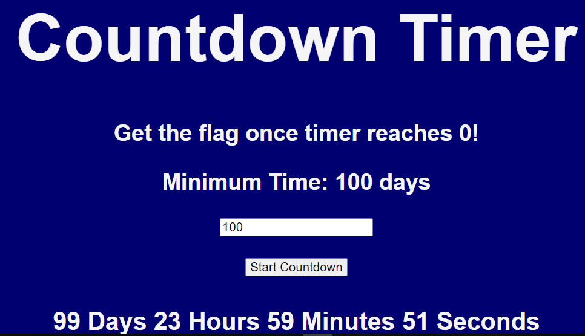
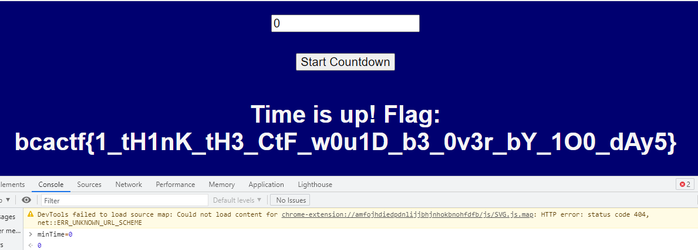

# Countdown Timer

## Description

Get the flag once the countdown timer reaches zero! However, the minimum time you can set for the countdown is 100 days, so you might be here for a while.

## Solution



Nói chung là bài yêu cầu ta nhập vào số ngày và nó sẽ đếm ngược , nếu đếm về 0 thì sẽ có flag.

CRTL + U => Code javascript :

```
var time = 100000;
var minTime = 100;
var daysInput = document.getElementById("countdownDays");
var counter;
document.getElementById("startButton").onclick = function () {
    startCountDown();
};
document.getElementById("minTimeHeader").innerHTML = "Minimum Time: " + minTime + " days";

daysInput.min = minTime;

function startCountDown() {
    clearInterval(counter);
    if (daysInput.value < minTime) {
        daysInput.value = minTime;
    }
    time = daysInput.value * 24 * 60 * 60;
    counter = setInterval(countdown, 1000);
}

function countdown() {
    time -= 1;
    if (time <= 0) {
        getFlag();
        clearInterval(counter);
        return;
    }
    var numdays = Math.floor(time / 86400);
    var numhours = Math.floor((time % 86400) / 3600);
    var numminutes = Math.floor(((time % 86400) % 3600) / 60);
    var numseconds = ((time % 86400) % 3600) % 60;
    document.getElementById("remainingTime").innerHTML = numdays + " Days " + numhours + " Hours " + numminutes + " Minutes " + numseconds + " Seconds";
}
```
Nhìn vào source code ta sẽ thấy số ngày ta nhập vào ít nhất là 100 (minTime=100), tuy nhiên vì là js nên ta có thể thay đổi biến trực tiếp trên trình duyệt qua devtool trong phần console .

 