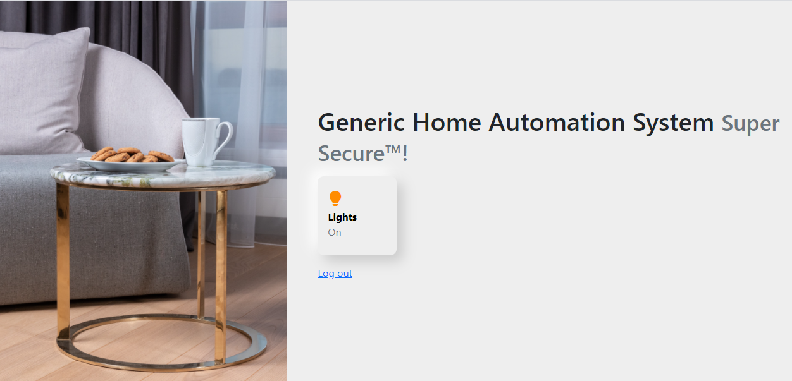
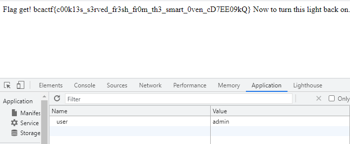

# Home Automation

## Description

Check out my super secure home automation system! No, don't try turning the lights off...

## Solution

Nhiệm vụ là tắt được đèn ta sẽ lấy được cờ .Tuy nhiên khi ta lấy nhấn tắt đèn web sẽ ném cho ta một thông báo .

>You must be admin to turn off the lights. Currently you are "vampire".

Vậy là chỉ có admin mới tắt được đèn , ta lại thấy có một cookie có dạng user:vampire tồn tại . Ok đơn giản là chỉ cần sửa vampire => admin sau đó F5 và tắt đèn là có flag .

  
