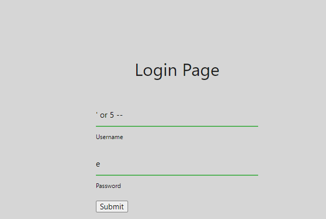

# Movie-Login-(1,2,3)

## Description

1.I heard a new movie was coming out... apparently it's supposed to be the SeQueL to "Gerard's First Dance"? Is there any chance you can help me find the flyer?

2.It's that time of year again! Another movie is coming out, and I really want to get some insider information. I heard that you leaked the last movie poster, and I was wondering if you could do it again for me?

>denylist.json
```
[
    "1",
    "0",
    "/",
    "="
]
```

3.I think the final addition to the Gerard series is coming out! I heard the last few movies got their poster leaked. I'm pretty sure they've increased their security, though. Could you help me find the poster again?

>denylist.json
```
[
    "and",
    "1",
    "0",
    "true",
    "false",
    "/",
    "*",
    "=",
    "xor",
    "null",
    "is",
    "<",
    ">"
]
```

## Solution



Nói cho đơn giản 3 chall này đều bị dính lỗi SQLi cho form đang nhập và vector tấn công sẽ đơn giản là làm cho câu truy vấn thành luôn đúng hay nói cách khác login thành công .

Cả 3 chall này là phiên bản nâng cấp của nhau nó sẽ filter lần lượt các kí tự quan trọng tuy nhiên không quá khó khăn để giải quyết tất cả .

>PAYLOAD:
user = ' or 5 --
pass = điền cái gì cũng đc .

Tại sao lại vậy ?
Bạn hãy tưởng tượng câu truy vấn trong trường hợp này có dạng :

>SELECT user,pass FROM database WHERE user = $USER  AND pass= $PASS

sau khi truyền payload vào câu truy vấn sẽ có dạng :

> SELECT user,pass FROM database WHERE user = '' or 5 -- AND pass='xxx'

Như vậy câu truy vấn trở thàn luôn đúng với đk TRUE (1 số nguyên dương được hiểu là điều kiện đúng) -- sẽ comment phần phía sau và web sẽ ko quan tâm đến phần đó nữa .

Như vậy với việc sử dụng payload này ta sẽ bypass ddc cả ba chall ==))

