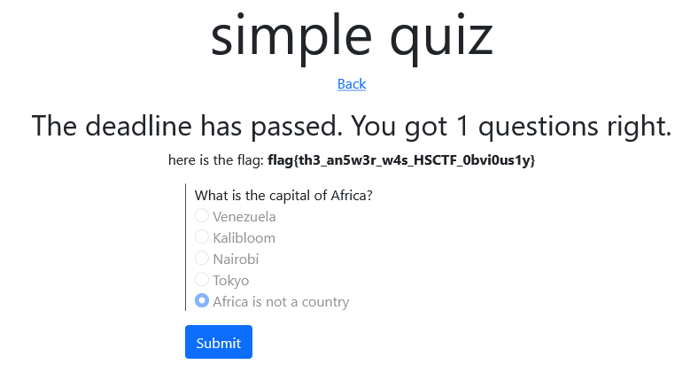

# Grading

## Description

Did you attend online school this year?

Good, because you'll need to register at grading.hsc.tf and get anA on "simple quiz" to find the flag.

Server code is attached.

## Solution

Sau khi đăng nhập vào một tài khoản do mình tự tạo ta sẽ thấy xuất hiện hai bài test :


Có thể thấy một bài test đã hết hạn (13/5/2021), và một bài test sẽ hết hạn vào (19/5/2021) tức là lúc event này kết thúc .
```
const failedTest = {
                name: "simple quiz",
                questions: [
                    user.questions[0]._id,
                ],
                deadline: new Date(2021, 5, 13, 0, 0, 0)
            }
            
            const newTest = {
                name: "another simple quiz",
                questions: [
                    user.questions[1]._id,
                ],
                deadline: new Date(2021, 5, 19, 0, 0, 0)
            } 
```

Tiếp theo tôi thấy servẻ kiểm tra câu hỏi và trả lời bằng cách sử dụng ID .

```
.post(authMW, (req, res) => {
    const now = Date.now()
    const form = req.user.forms.id(req.params.formID)
    if(now > form.deadline) {
        res.json({response: "too late"})
    } else {
        if(req.body.ID) {
            const question = req.user.questions.id(req.body.ID)
            console.log(question);
            question.submission = req.body.value
            req.user.save()
        } else {
            form.submitted = true
            req.user.save()
        }

        res.json({response: "heh"})
    }

}) 
```
Và còn một điều nữa là câu hỏi sẽ chỉ được check khi form hết hạn vậy để lấy được flag ta sẽ cần thay đổi giá trị ID của câu hỏi và câu trả lời của form chưa hết hạn bằng ID của form đã hết hạn . Cụ thể như sau :

> ID question simple quiz : 60ce91268c156e4a10529a43
> ID answer simple quiz : 60ce91268c156e7e03529a41 (answer : "Africa is not a country"  )

> Form another simple quiz sau khi thay đổi :
```
<div class="container mid">
    <form action="/60ce91268c156e4a10529a43" method="POST" onsubmit="return true;">
         
        <div class="mb-3 question">
            <label for="">What is the best CTF?</label>
            
                <input type="text" disabled class='active' name="60ce91268c156e7e03529a41" value="Africa is not a country">
             
        </div>
         
        <button class="btn btn-primary" type="submit">Submit</button>
    </form>
</div>
```

Sau khi submit ta cần quay lại **simple quiz** để lấy flag .



## Flag

flag{th3_an5w3r_w4s_HSCTF_0bvi0us1y}