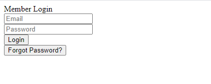
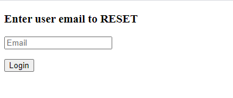
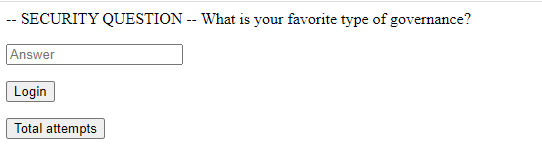

# All about resetting

## Description

Who can guess my password or.. http://all-about-resetting.ctf2021.hackpack.club

## Point

50 point

## Hint

why I need db if I have sessions?

## Solution 



Một form đăng nhập nhưng để cho đẹp vì nó chả để làm gì , ta sẽ tập chung vào phần forgot passwd và mk cò tìm được 1 email **npantel@ncsu.edu** :

```
<form action="/reset" method="post">
		<button type="submit" value="Send Email" >Forgot Password?</button>
	</form>
```
Sau khi truy cập vào /reset ta có một form khác yêu cầu xác nhận email.



Ta nhập email tìm được ở trên vào :



Web yêu cầu bạn phải trả lời câu hỏi xác thực 'What is your favorite type of governance?', sau khi thử rất nhiều pass khác nhau tuy nhiên bất thành tôi nhận thấy site có một cookie.

> .eJyrVkpLzMyJT84rUbIy1QFyyvKLMktS0_PLUovyEvOSU5WslLITszOLS_KTixKTK5UQakpSE3OBsvk5lbkFmYnJ-cVKtQBdwByf.YHzutg.GXFwlDkCU7ddZ8_IQsj7rZUOzIc

Đây là cookie dạng jwt , ta có thể decode nó bằng code sau :

```
import zlib
import base64

j = zlib.decompress(base64.urlsafe_b64decode(b"eJyrVkpLzMyJT84rUbIy0wFyyvKLMktS0_PLUovyEvOSU5WslLITszOLS_KTixKTK5UQakpSE3OBsvk5lbkFmYnJ-cVKtQBeAhyg"))

print(j)

#b'{"fail_cnt":6,"favoritegovernance":"kakistocracy","favoriteteam":"olympiacos"}'
```

Sau khi decode ta có được một danh sách các câu trả lời việc tiếp theo sẽ là thử từng giá trị trong danh sách vào để lấy flag .

## Flag

flag{Wh4t_1s_th1s_gov3rn4nc3_!!!}
