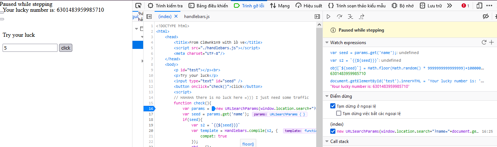

# JS-debug

## Description

Không dành cho những người thiếu kiên nhẫn flag trong file JS luôn đó giỏi tìm đi =)))

url :http://45.77.45.157:10002/ 


## Solution 

```
<!DOCTYPE html>
<html>
    <head>
        <title>From Cl0wnk1n9 with lò ve</title>
        <script src="./handlebars.js"></script> 
        <meta charset="UTF-8"/>
    </head>
    <body>
        <p id="test"></p><br>
        <p>Try your luck</p>
        <input type="text" id="seed" />
        <button onclick="check()">click</button>
        <script> 
        // HAHAHA there is no luck here =))) I just need some traffic 
        function check(){
            var params = new URLSearchParams(window.location.search+"?name="+document.getElementById("seed").value);
            var seed = params.get('name');
            if(seed){
                var s2 = `{{${seed}}}`
                var template = Handlebars.compile(s2, { 
                    compat: true
                }); 
                obj = {};
                obj[`${seed}`] = Math.floor(Math.random() * 9999999999999999)+1000000000000000; 
                document.getElementById('test').innerHTML =  'Your lucky number is: ' +template(obj);
            }
        }
        </script> 
    </body>
</html>
```

Như trên ta có thể thấy có 2 thẻ script được khai báo :

- Thể đầu tiên import một file js có tên handlebars.js , khi truy cập vào file này thì có rất nhiều code nên cũng không làm được gì nhiều ngoài xem (chỉ xem thôi).

- Thẻ script thứ hai thì có một hàm check() hàm này sẽ được gọi khi ta nhấn nút submit .Hàm này có nhiệm vụ sinh cho ta một số ngẫu nhiên mỗi khi ta nhập một cái gì đó vào tất nhiên là không phải nhập vào cái gì cũng được .

> Expecting 'ID', 'STRING', 'NUMBER', 'BOOLEAN', 'UNDEFINED', 'NULL', 'DATA', got 'INVALID'"

Tiếp theo ta sẽ cần chú ý đến hàm **Handlebars.compile(template, options)** vì đây là manh mối duy nhất .

- Handlebars là một ngôn ngữ tạo mẫu đơn giản .Nó sử dụng một mẫu và một đối tượng đầu vào để tạo HTML hoặc các định dạng văn bản khác. Các mẫu Handlebars trông giống như văn bản thông thường với các biểu thức Handlebars được nhúng.

- Handlebars.compile(template, options) là hàm có chức năng biên dịch một mẫu để nó có thể được thực thi ngay lập tức.(https://handlebarsjs.com/api-reference/compilation.html#handlebars-compile-template-options). 

Vì vậy có thể nói biến template sẽ được dùng để in ra giá trị của luckynumber .
```
var template = Handlebars.compile(s2, { 
                    compat: true
                }); 
```



Ta có thể thấy giá trị các biến sau khi debug hoàn toàn bình thường và không có điểm khả nghi.

Đến đây khá là betak rồi , mk bắt đầu quay sang file Handlebars.js thì thấy phiên bản đang dùng là **handlebars v4.7.4** , thử google xem thì hóa ra phiên bản này đang dính lỗi **Prototype Pollution** và thật may là trong report có cả POC của lỗi này nhưng trước khi bắt đầu ta cần tìm hiểu xem Prototype Pollution là gì đã .

Tấn công Prototype Pollution giống như cái tên đã gợi ý phần nào, là hình thức tấn công (thêm/sửa/xoá thuộc tính) vào prototype của Object trong trong Javascript dẫn đến sai khác logic, nhiều khi dẫn đến việc thực thi những đoạn code tuỳ ý trên hệ thống (Remote Code Excution - RCE).(https://viblo.asia/p/tan-cong-prototype-pollution-tren-cac-ung-dung-nodejs-oOVlYwLvK8W)

Kẻ tấn công thao túng các thuộc tính này để ghi đè hoặc làm ô nhiễm nguyên mẫu đối tượng ứng dụng JavaScript của đối tượng cơ sở bằng cách chèn các giá trị khác. Trong trường hợp này code bị dính lỗi *Object Unsafe recursive merge*.

Dưới đây là logic của hàm đệ quy không an toàn :

```
merge (target, source)

  foreach property of source

    if property exists and is an object on both the target and the source

      merge(target[property], source[property])

    else

      target[property] = source[property]
```

Khi đối tượng nguồn chứa một thuộc tính có tên _proto_ được xác định với Object.defineProperty(), điều kiện sẽ kiểm tra xem thuộc tính có tồn tại và là một đối tượng trên cả đích và nguồn đi qua và hợp nhất lặp lại với đích, là nguyên mẫu của Object và nguồn của Objectnhư được xác định bởi kẻ tấn công. Các thuộc tính sau đó được sao chép trên Objectnguyên mẫu. 

(Source: https://snyk.io/vuln/SNYK-JS-HANDLEBARS-1279029)

>Payloads: 'a/.") || alert("Vulnerable Handlebars JS when compiling in compat mode'

Trước tiên mk sẽ truyền payloads vào form và bật debug lên :


Ta sẽ thấy nó sẽ nhảy luôn đến hàm wrapper và việc cần làm là tiếp tục dùng step over để đi đến *return wrapper* nó trả về cho ta một trang SOURCE .

```
var helper, lookupProperty = container.lookupProperty || function(parent, propertyName) {
        if (Object.prototype.hasOwnProperty.call(parent, propertyName)) {
          return parent[propertyName];
        }
    var Chall_flag = atob("S0NTQ3tXMHdfWTB1X0QzYnVnX1dob2xlX3RoMXNfU2ghdD9fVGg0dF9Bd3MwbTN9");
     return undefined
    };

  return container.escapeExpression(((helper = (helper = lookupProperty(helpers,"a/.\") || alert(\"Vulnerable Handlebars JS when compiling in compat mode") || container.lookup(depths, "a/.") || alert("Vulnerable Handlebars JS when compiling in compat mode")) != null ? helper : container.hooks.helperMissing),(typeof helper === "function" ? helper.call(depth0 != null ? depth0 : (container.nullContext || {}),{"name":"a/.\") || alert(\"Vulnerable Handlebars JS when compiling in compat mode","hash":{},"data":data,"loc":{"start":{"line":1,"column":0},"end":{"line":1,"column":76}}}) : helper)));
```

Đến đây ta thấy cờ được lưu ở dạng base64 (Chall_flag) việc còn lại là decode và lấy flag :))


## Flag

 KCSC{W0w_Y0u_D3bug_Whole_th1s_Sh!t?_Th4t_Aws0m3}


 

