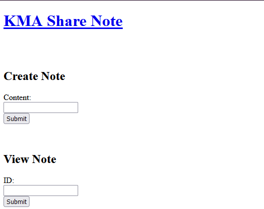
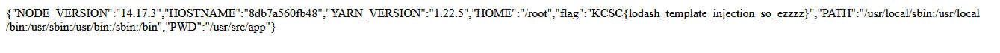

# KMA SHARE NOTE

## Solution



Web có hai chức năng chính đó là tạo một note và sau đó nó sẽ cấp cho ta một ID để xem lại note đó .

Không có quá nhiều thứ để khai thác tôi quyết định dirsearch và tìm được **/source**.
```
const express = require("express");
const lodash = require("lodash");
const escapeHTML = require("escape-html");
const { v4: uuidv4 } = require("uuid");

const app = express();
app.use(express.urlencoded({ extended: false }));

let note = [];

// Homepage
app.get("/", async (req, res) => {
  res.sendFile(__dirname + "/index.html");
});

// API
app.post("/add-note", (req, res) => {
  let content = req.body.content;
  let note_id = uuidv4();
  let n = {
    id: note_id,
    content: content,
  };
  note.push(n);
  const compiled = lodash.template("Note ID: " + note_id);
  res.status(200).send(compiled());
});

app.post("/view-note", (req, res) => {

  const note_id = req.body.id;

  let content = lodash.find(note, { id: note_id });

  if (content) {
    const compiled = lodash.template(escapeHTML(content["content"]));
    res.status(200).send(compiled());
  } else {
    const compiled = lodash.template("ID not found");
    res.status(200).send(compiled());
  }
});

app.listen(1499, () => {
  console.log("Note app listening on port 8000!");
});
```

Có thể thấy web chạy bằng node.js và đang dùng hai package đó là *express* và *lodash* . Đảo qua file package-lock.json ta có một hint vô cùng rõ ràng .

```
"name": "lodash_template_injection",
  "lockfileVersion": 2,
  "requires": true,
  "packages": {
    "": {
      "dependencies": {
        "express": "^4.17.1",
        "lodash": "^4.17.20",
        "uuid": "^8.3.2"
      }
    }
```

Từ điểm này ta có thể đoán được web đang tồn tại lỗ hổng template inject trong thư viện lodash , mặt khác version đang dùng là 4.17.20 vừa hay nó có CEV. 
Theo web https://snyk.io/vuln/SNYK-JS-LODASHTEMPLATE-1088054 ,thì hiện tại lỗ hổng này đang ảnh hưởng đến tất cả các phiên bản và chưa có bản vá vào thời điểm hiện tại. Thông qua báo cáo về lỗi này trên *Hackone* , thì việc khai thác sẽ được thực hiện qua hàm **_.template** với việc đầu vào không được làm sạch và kẻ tấn công có thể kiểm soát giá trị của tham số đầu vào để đưa vào các đoạn mã tùy ý .  

```
app.post("/add-note", (req, res) => {
  let content = req.body.content;
  let note_id = uuidv4();
  let n = {
    id: note_id,
    content: content,
  };
  note.push(n);
  const compiled = lodash.template("Note ID: " + note_id);
  res.status(200).send(compiled());
});
```

Dễ thấy chức năng /add-note đang thỏa các điều kiện nói trên , cụ thể ta có thể đưa vào một đoạn mã js đóng vai trò là content note sau đó lấy id và view note khi đó nội dung note sẽ là kết quả mã được thực thi .

Payload : ${JSON.stringify(process.env)}

Payload này sẽ làm nhiệm vụ in ra tất cả các biến môi trường trong web , **process.env** là một object chứa các biến môi trường và hàm **JSON.stringify** làm công việc chuyển object thành chuỗi.



## Flag

KCSC{lodash_template_injection_so_ezzzz}

## Document

https://hackerone.com/reports/904672


