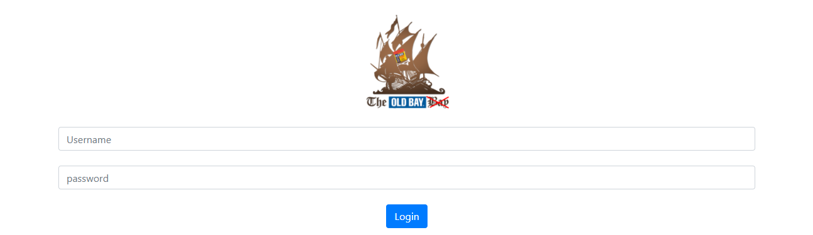
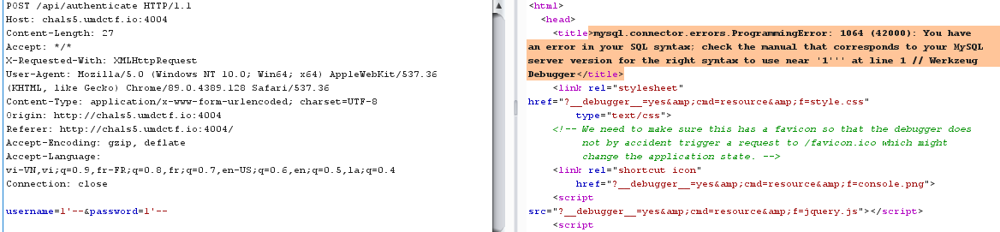
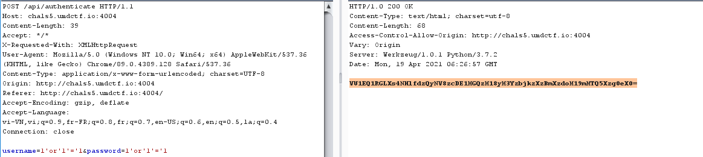
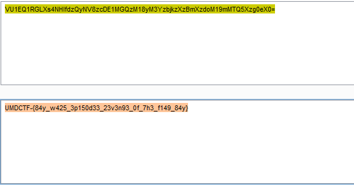

# Return of the Flag Bay

## Description

We loved the flag bay so much, that we decided to bring it back. Although, something is a bit different about this one. We can't figure out which username and password is correct from the list of users. Can you help us figure it out?

http://chals5.umdctf.io:4004

## Solution

Một form đăng nhập cái đầu tiên tôi nghĩ đến là lỗi Sqli .

Sau khi nhập vào username=1'-- và password=1'--, chương trình debug trả về lỗi từ đây ta có thể xác định cơ sở dữ liệu là mysql. 

> Payload: 
>>username = 1'or'1'='1
>>password = 1'or'1'='1 

Web trả về nội dung là một đoạn mã base64, decode và get flag.

## Flag

UMDCTF-{84y_w425_3p150d33_23v3n93_0f_7h3_f149_84y}