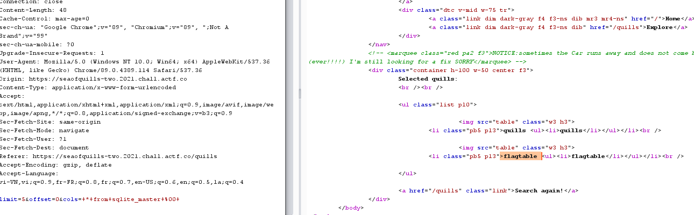
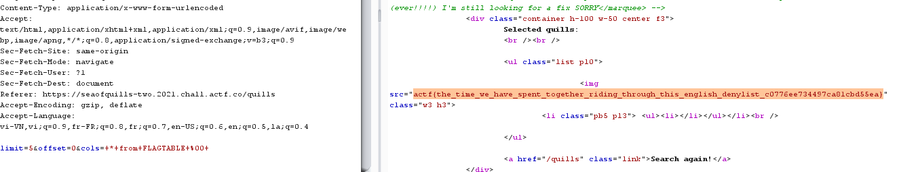

## Sea of Quills

# Description

A little bird told me my original quills store was vulnerable to illegal hacking! I've fixed my store now though, and now it should be impossible to hack!

[Source](app.rb)

# Points

160 point

# Solution

```
require 'sinatra'
require 'sqlite3'

set :server, :puma
set :bind, "0.0.0.0"
set :port, 4567
set :environment, :production

get '/' do
	db = SQLite3::Database.new "quills.db"
	@row = db.execute( "select * from quills" )
	

	erb :index
end

get '/quills' do
	erb :quills	

end


post '/quills' do
	db = SQLite3::Database.new "quills.db"
	cols = params[:cols]
	lim = params[:limit]
	off = params[:offset]
	
	blacklist = ["-", "/", ";", "'", "\"", "flag"]
	
	blacklist.each { |word|
		if cols.include? word
			return "beep boop sqli detected!"
		end
	}

	
	if cols.length > 24 || !/^[0-9]+$/.match?(lim) || !/^[0-9]+$/.match?(off)
		return "bad, no quills for you!"
	end

	@row = db.execute("select %s from quills limit %s offset %s" % [cols, lim, off])

	p @row

	erb :specific
end

```

Tương tự như phần 1 nhiệm vụ của chúng ta là phải thực hiện inject sql vào trường cols . Tuy nhiên phần 2 này có một số sự khác biệt :

> blacklist = ["-", "/", ";", "'", "\"", "flag"]
> Limit lenght < 24 chars

Vì vậy ta không thể sử dụng được phương án union như bài trước đó . Ý tưởng là phải bypass được cái lenght trước tuy nhiên mọi nỗ lực sử dụng comment đều bất thành vì bị filter cho đến khi mình tìm thấy một kí tự **%00** (nullbyte) dùng để ngắt câu sql và như thế ta có thể bỏ phần phía sau để đảm bảo độ dài cho payload

> Payload : * from sqlite_master %00



Như các bạn có thể thấy ta có một bảng tên **flagtable** chứa flag, tuy nhiên *flag* lại bị filter đến đây mình hoàn toàn rơi vào bế tắc và đành xin hint từ người anh xã hội **nhientit** . Hóa ra sqlite thì không phân biệt chữ hoa và thường vậy nên giờ đây việc cần làm là thay đổi *flagtable* sang chữ hoa *FLAGTABLE* và pass .


