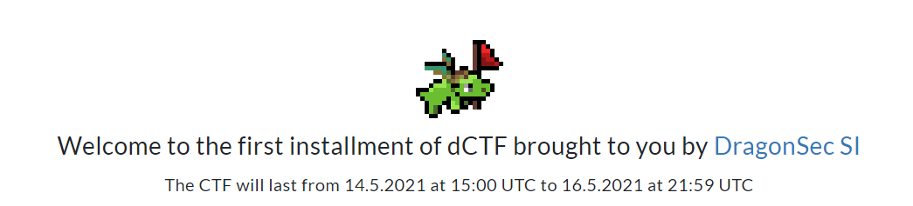
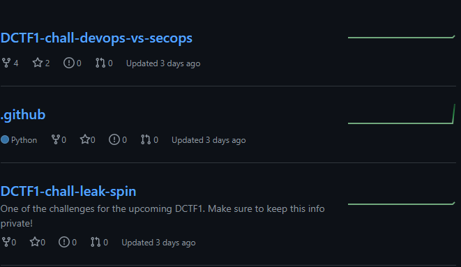

# DevOps vs SecOps

## Description

Automatization is amazing when it works, but it all comes at a cost... You have to be careful...

(URL not missing)

## Hints

What does automation and DevOps remind you of? For me thats CI/CD...

## Solution

Đây là 1 guess chall, một bài web nhưng lại có category misc. Bạn sẽ không được cho sẵn web site như thường lệ mà tác giả bắt bạn phải đi tìm .

Sau một hồi mày mò tôi đã tìm thấy thứ cần tìm ở trang /home. Click vào link phía trên cùng bạn sẽ được đưa đến một trang web và ở đó chứa link github . Tại sao lại là link github ?

Vì dựa theo hint tác giả cho CI/CD đều là các tiến trình tự động hóa và hoạt động trên một số nền tảng trong đó có github(Tìm hiểu thêm:https://viblo.asia/p/ci-cd-va-devops-07LKXYXDZV4) .

Đây là github khi tôi truy cập vào , sau một hồi lục lọi tôi đã tìm thấy flag trong '.git/setup.py',như đã nói ở đầu 'just guess'

## Flag :

dctf{H3ll0_fr0m_1T_guy}

Bonus: Trong github ko chỉ có chall web mà còn có một chall khác cửa misc đó là 'leak_spin', bạn có thể tìm thấy flag của chall tại (https://github.com/DragonSecSI/DCTF1-chall-leak-spin/blob/main/challenge.yml) .@@

Very lucky !!!!