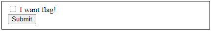
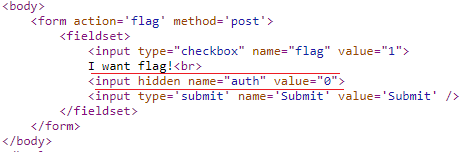

# Simple web

## Description

Time to warm up!
http://dctf1-chall-simple-web.westeurope.azurecontainer.io:8080
100 points

## Solution

Bài đầu tiên không quá khó mục đích để khỏi động , đầu tiên ta sẽ có một form quen thuộc.

Tôi thử tick vào box 'I want flag' để xem có flag hay ko thì ... tất nhiên rồi ko có đâu, chỉ có một thông báo nhỏ **Not authorized**

View soure code ta sẽ thấy có một thẻ input bị hidden với *'auth':'0'*, ok vậy là chỉ cần sửa giá trị này thành '1' và submit lại là sẽ có flag.

## Flag

There you go: dctf{w3b_c4n_b3_fun_r1ght?}