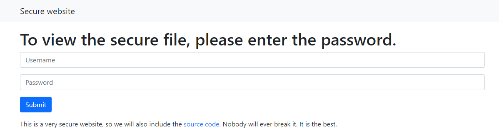

# Very secure website

## Description

Some students have built their most secure website ever. Can you spot their mistake?
http://dctf1-chall-very-secure-site.westeurope.azurecontainer.io/

## Solution



Bài này cho soure code vậy nên ta sẽ không vội mà đi fuzz cái form login kia , để xem soure code có gì nào !

```
<?php
    if (isset($_GET['username']) and isset($_GET['password'])) {
        if (hash("tiger128,4", $_GET['username']) != "51c3f5f5d8a8830bc5d8b7ebcb5717df") {
            echo "Invalid username";
        }
        else if (hash("tiger128,4", $_GET['password']) == "0e132798983807237937411964085731") {
            $flag = fopen("flag.txt", "r") or die("Cannot open file");
            echo fread($flag, filesize("flag.txt"));
            fclose($flag);
        }
        else {
            echo "Try harder";
        }
    }
    else {
        echo "Invalid parameters";
    }
?>
```

Nhìn nhanh ta có thể thấy code check login bằng user và password khi được encode **tiger128,4**.
Nhưng nó lại ko check user và passwd đồng thời , bạn sẽ chỉ cần bypass được cái passwd là sẽ lấy được flag .

Dựa vào việc code check passwd bằng dấu **==** và được encode bằng một loại hash nên ta có thể nghĩ đến một lỗ hổng trong php đó là *PHP Type Juggling*(https://viblo.asia/p/php-type-juggling-924lJPYWKPM) kết hợp với *magic hash* để bypass.

Tiếp theo ta chỉ cần login với 'user=admin' và 'pass=LnFwjYqB'.
(user có thể điền bất kì , pass sẽ là 1 magic hash *tiger128,4* bắt đầu bằng '0e' có thể tìm thấy ở(https://github.com/spaze/hashes/blob/master/tiger128%2C4.md))


## Flag

```dctf{It's_magic._I_ain't_gotta_explain_shit.}```

