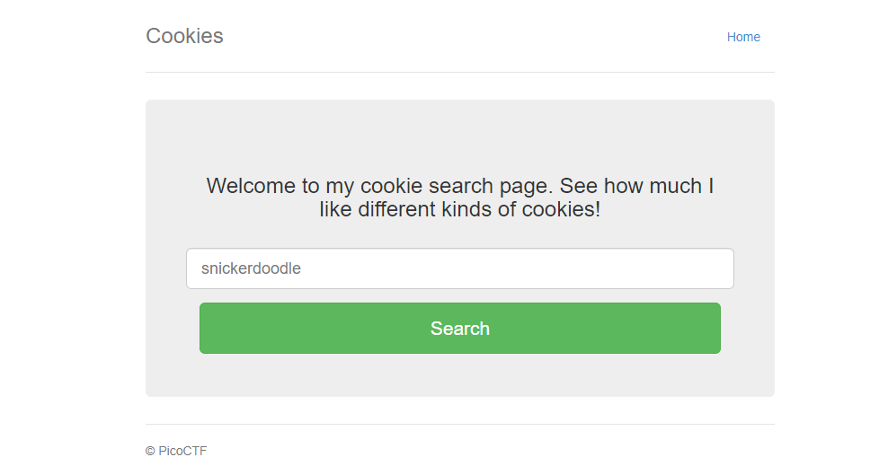
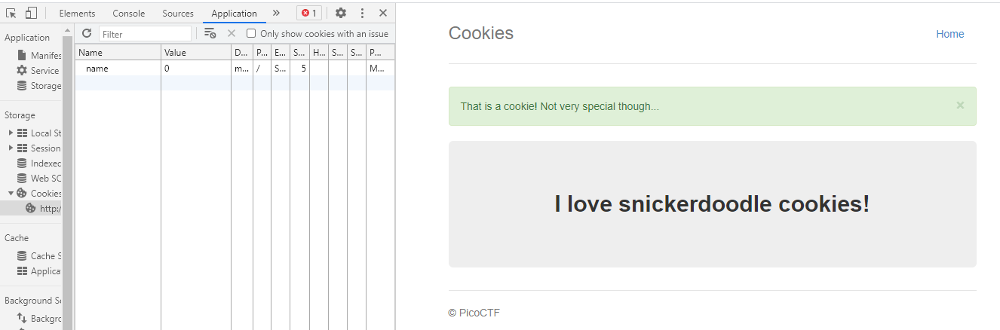

# Cookies

## Description

Who doesn't love cookies? Try to figure out the best one. http://mercury.picoctf.net:21485/

## Hint 

None

## Points

40 points

## Solution

Challenge sẽ có dạng một form yêu cầu ta nhập vào một loại cookies nào đó cần tìm như sau :



OK ta thử nhập vào "snickerdoodle" xem sao thì nó đưa ta đến một trang */check* và kết quả trả về là 1 thông báo success:

> I love snickerdoodle cookies!

Vì title là cookie nên ta sẽ vào devtool và kiểm tra cookie của nó và kết quả :



Ta có thể thấy có một cookie **name : 1** .Mình thử thay đổi giá trị của name thành một số khác thì thấy web trả về một loại thông báo khác vậy khả năng ta có thể inject vào cookie name này bằng cách *brute force* value .

Để giải quyết task này mình có [script](script.py) sau :

```
import requests, re

url = "http://mercury.picoctf.net:21485/check"

for i in range(20):
	cookie  = {'name': str(i)}
	res = requests.get(url , cookies=cookie)
	flag = re.findall('picoCTF{.*}', res.text)

	if flag :
		print('-----Binggo-----')
		print(flag)
		break
``` 

## Flag

picoCTF{3v3ry1_l0v3s_c00k135_94190c8a}
