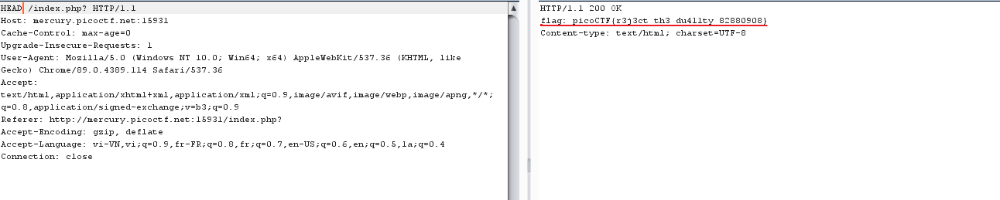

# GET aHEAD

## Description
Find the flag being held on this server to get ahead of the competition http://mercury.picoctf.net:15931/

## Points
20 points

## Hint
Maybe you have more than 2 choices
Check out tools like Burpsuite to modify your requests and look at the responses

## Solution

Ta đi vào phân tích code html :

```
<!doctype html>
<html>
<head>
    <title>Red</title>
    <link rel="stylesheet" type="text/css" href="//maxcdn.bootstrapcdn.com/bootstrap/3.3.5/css/bootstrap.min.css">
	<style>body {background-color: red;}</style>
</head>
	<body>
		<div class="container">
			<div class="row">
				<div class="col-md-6">
					<div class="panel panel-primary" style="margin-top:50px">
						<div class="panel-heading">
							<h3 class="panel-title" style="color:red">Red</h3>
						</div>
						<div class="panel-body">
							<form action="index.php" method="GET">
								<input type="submit" value="Choose Red"/>
							</form>
						</div>
					</div>
				</div>
				<div class="col-md-6">
					<div class="panel panel-primary" style="margin-top:50px">
						<div class="panel-heading">
							<h3 class="panel-title" style="color:blue">Blue</h3>
						</div>
						<div class="panel-body">
							<form action="index.php" method="POST">
								<input type="submit" value="Choose Blue"/>
							</form>
						</div>
					</div>
				</div>
			</div>
		</div>
	</body>
</html>
```

Chúng ta có thể thấy web có 2 lựa chọn đó là **Red** đi với **GET** và **Blue** thì đi với **POST** . Kết hợp với hint ta đi đến kết luận là sẽ gửi đi request với một phương thức khác GET VÀ POST .
Ðể ý vào tiêu đề *Get aHead* tôi có thể biết mình cần gửi request đó đi với phương thức HEAD lên server để get flag .
Ð?u tiên ta sẽ bắt request với Burp Suite sau dó là g?i vào repeat và s?a GET > HEAD gửi lại request và có flag .

 

## Flag 

picoCTF{r3j3ct_th3_du4l1ty_6ef27873}

